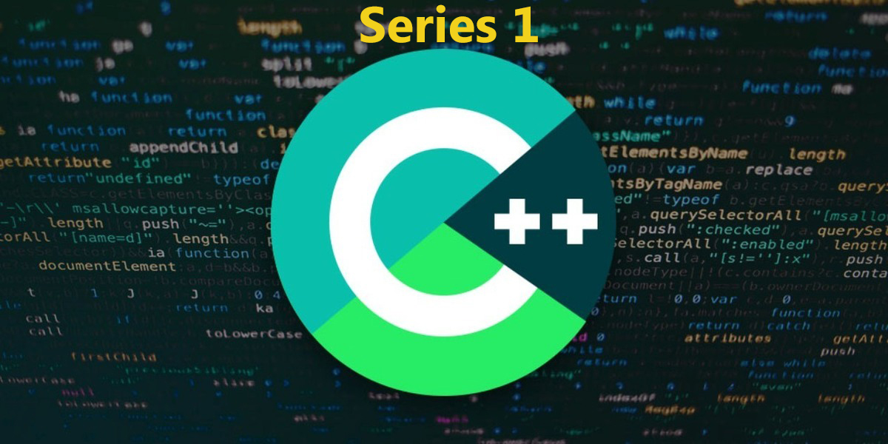
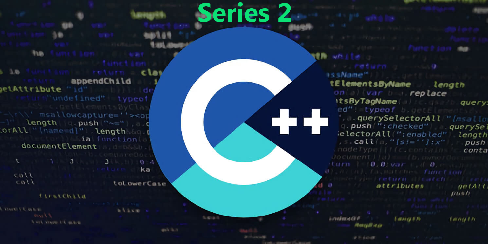

# cpp-playground
* Practice C++ coding with other github repos.
* Uses C++17 standard
* For Fundamental C++ concepts visit [here](./base)
* For custom libs [here](./libs)
* Includes
	- Boost C++ lib
	- Data Science
* Related Courses added on Udemy

## Installation
Please refer to [this](https://github.com/abhi3700/My_Learning-Cpp#installation)

## Available Courses (related to this repo. content) on Udemy
* [Learn Professional C++ | Introduction to Boost C++ Libraries](https://www.udemy.com/course/learn-professional-c-introduction-to-boost-c-libraries/)
	- Learn Non-std. C++ functions, containers, classes for Professional coding in C/C++. 
	- Gear-up for Industrial applications.

	

		
	

* [Learn Professional C++ | Using Custom Libraries](https://www.udemy.com/course/learn-professional-c-using-custom-libraries/)
	- Learn Non-std. C++ Libraries for Professional coding in C/C++. 
	- Gear-up for Industrial applications.

	

		
	

## Dependencies
* C++ Include libs - `include`
	- [simdjson](https://github.com/lemire/simdjson) - `svn`
		+ create: `svn checkout https://github.com/lemire/simdjson/trunk/include/simdjson`
		+ update: `cd boost` >> `svn update`  
	- [spdlog](https://github.com/gabime/spdlog)
	https://github.com/gabime/spdlog/branches/v1.x/include/spdlog
		+ create: `git clone -b v1.x --single-branch https://github.com/gabime/spdlog.git`
		+ update: `cd spdlog` >> `git pull`

* C++ Github repositories (References)- `gitcpplibs`
	- [exercism](https://github.com/exercism/cpp)	- `svn`
		+ create: `svn checkout https://github.com/exercism/cpp/trunk/exercises exercism-exercises`
		+ update: `cd exercism-exercises` >> `svn update` (inside the folder)
	- [denismatveev-exercises](https://github.com/denismatveev/exercises) - `git`
		+ create: `git submodule add https://github.com/denismatveev/exercises.git denismatveev-exercises`
		+ update: `cd denismatveev-exercises` >> `git pull`
	- [sagar-cpp](https://github.com/Sagar-022/c_plus_plus) - `git`
		+ create: `git submodule add https://github.com/Sagar-022/c_plus_plus sagar-cpp`
		+ update: `cd sagar-cpp` >> `git pull`	
	- [cpp-primer](https://github.com/Mooophy/Cpp-Primer.git) - `git`
		+ create: `git submodule add https://github.com/Mooophy/Cpp-Primer.git cpp-primer`
		+ update: `cd cpp-primer` >> `git pull`	
	- [leet-code](https://github.com/wj-zhu/leet-code) - `git`
		+ create: `git submodule add https://github.com/wj-zhu/leet-code.git leet-code`
		+ update: `cd leet-code` >> `git pull`
	- [boost-py-eg](https://github.com/TNG/boost-python-examples) - 'git'
		+ create: `git submodule add https://github.com/TNG/boost-python-examples.git boost-py-eg`
		+ update: `cd boost-py-eg` >> `git pull`
	- [cpp-patterns-wj](https://github.com/wj-zhu/cpp-patterns) - `git`
		+ create: `git submodule add https://github.com/wj-zhu/cpp-patterns.git cpp-patterns-wj`
		+ update: `cd cpp-patterns-wj` >> `git pull`
	- [cpp-wj](https://github.com/wj-zhu/snippets/tree/master/cpp) - `svn`
		+ create: `svn checkout https://github.com/wj-zhu/snippets/trunk/cpp cpp-wj`
		+ update: `cd cpp-wj` >> `svn update`

## Use
For using it in your local PC, follow the steps below:
* Clone the repo - `git clone https://github.com/abhi3700/cpp-playground.git`
* Update the blank submodule - `git submodule update`

